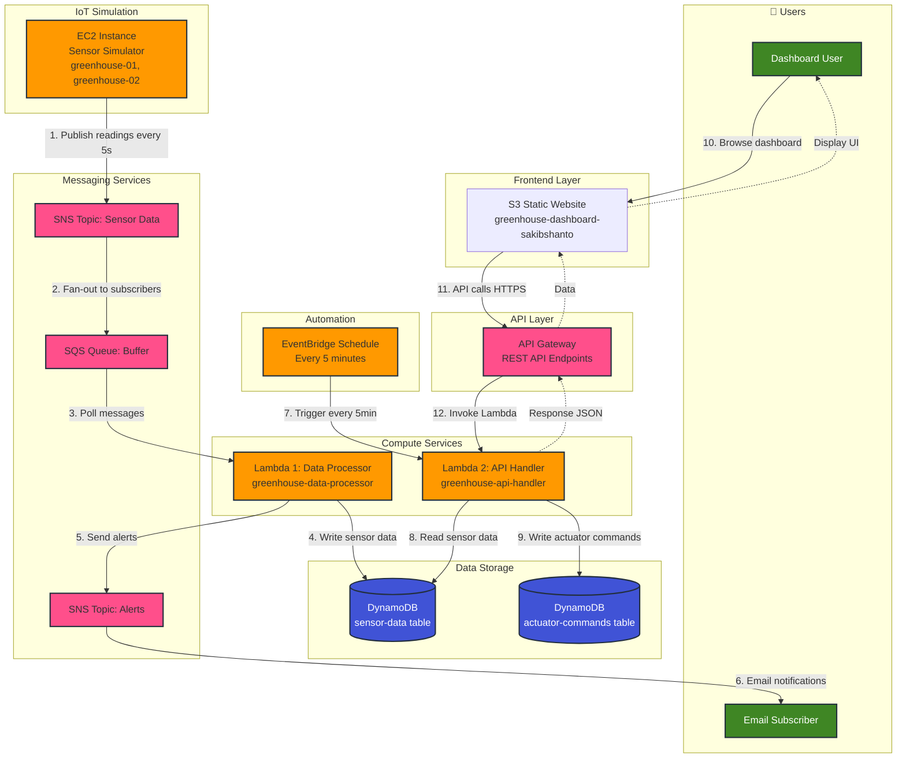

# Smart Greenhouse System Architecture - Mermaid Diagram

## Copy and paste this code into any Mermaid editor or GitHub markdown file

## Service Names

### Compute & Processing
- **EC2 Instance**: `greenhouse-iot-simulator-instance` (simulates 2 greenhouses)
- **Lambda #1**: `greenhouse-data-processor` (SQS → DynamoDB)
- **Lambda #2**: `greenhouse-api-handler` (API Gateway + EventBridge → DynamoDB)

### Storage
- **DynamoDB Table 1**: `greenhouse-sensor-data` (sensor readings)
- **DynamoDB Table 2**: `greenhouse-actuator-commands` (actuator commands + config)
- **S3 Bucket**: `greenhouse-dashboard-sakibshanto` (static website)

### Messaging
- **SNS Topic 1**: `greenhouse-sensor-data-topic` (sensor data distribution)
- **SNS Topic 2**: `greenhouse-alerts-topic` (alert notifications)
- **SQS Queue**: `greenhouse-sensor-data-queue` (buffer for Lambda #1)

### API & Automation
- **API Gateway**: `greenhouse-api` (REST API)
  - Base URL: `https://m0tdyp9dia.execute-api.us-east-1.amazonaws.com/prod`
- **EventBridge Rule**: `greenhouse-actuator-schedule` (rate: 5 minutes)

### Greenhouses
- **greenhouse-01**: Temperature, Humidity, Soil Moisture, Light Intensity sensors
- **greenhouse-02**: Temperature, Humidity, Soil Moisture, Light Intensity sensors

## Data Flow Sequence

1. **EC2** generates sensor readings → publishes to **SNS**
2. **SNS** fans out messages → **SQS** queue
3. **Lambda #1** polls **SQS** → validates → writes to **DynamoDB** (sensor-data)
4. **Lambda #1** detects alerts → publishes to **SNS** → emails user
5. **EventBridge** triggers **Lambda #2** every 5 minutes
6. **Lambda #2** reads sensor data from **DynamoDB**
7. **Lambda #2** makes actuator decisions based on thresholds
8. **Lambda #2** writes commands to **DynamoDB** (actuator-commands)
9. **Dashboard** calls **API Gateway** → **Lambda #2** → returns data
10. **User** views real-time data and controls actuators via dashboard
