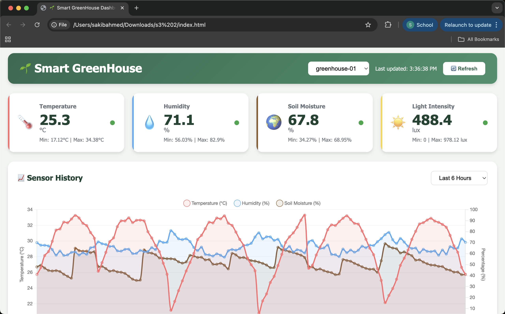
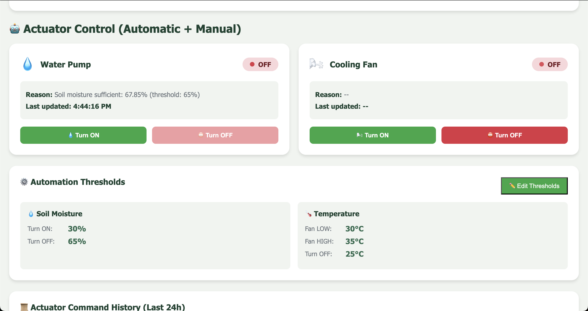
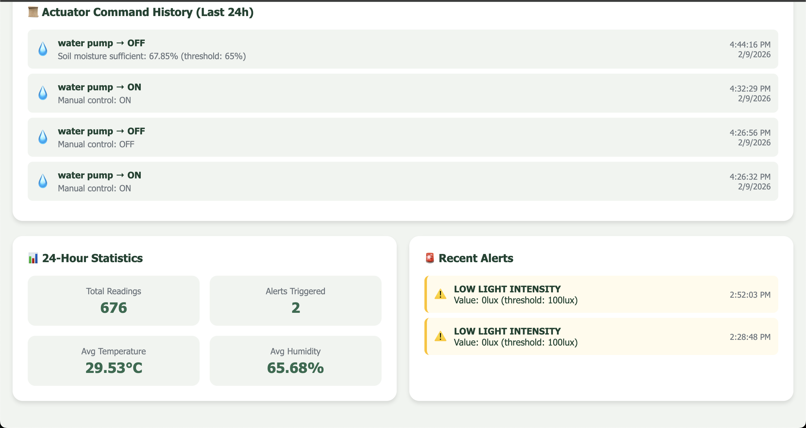
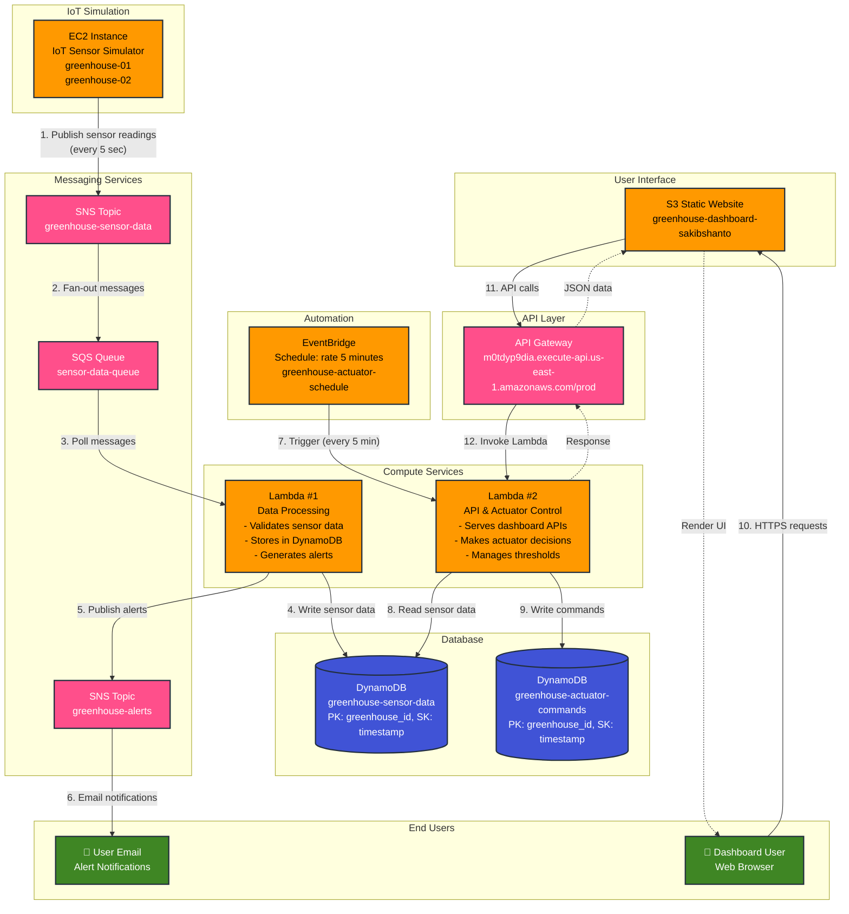

# 🌱 Smart GreenHouse - IoT Monitoring & Control System

A comprehensive cloud-based IoT solution for monitoring and automatically controlling greenhouse environmental conditions using AWS services.

  

**Live Dashboard:** [http://greenhouse-dashboard-sakibshanto.s3-website-us-east-1.amazonaws.com/](http://greenhouse-dashboard-sakibshanto.s3-website-us-east-1.amazonaws.com/)

---

## 📸 Screenshots

### Dashboard Overview

*Real-time sensor monitoring with live charts and current readings*

### Actuator Control Panel

*Manual and automatic control of water pump and cooling fan with threshold settings*

### Historical Data & Analytics

*24-hour statistics, alert history, and actuator command logs*

---

## 📋 Table of Contents

- [Overview](#overview)
- [Architecture](#architecture)
- [AWS Services Used](#aws-services-used)
- [Features](#features)
- [System Components](#system-components)
- [Setup & Deployment](#setup--deployment)
- [API Endpoints](#api-endpoints)
- [Automatic Control Logic](#automatic-control-logic)
- [Monitoring & Alerts](#monitoring--alerts)
- [Security](#security)

---

## 🎯 Overview

This Smart Greenhouse system provides real-time monitoring and automatic control of environmental conditions including:
- **Temperature** monitoring and cooling fan control
- **Humidity** tracking
- **Soil Moisture** monitoring and water pump automation
- **Light Intensity** measurement
- **Alert notifications** via email (SNS)
- **Historical data analysis** and visualization

The system uses a serverless architecture on AWS, ensuring scalability, reliability, and cost-effectiveness.

---

## 🏗️ Architecture

### System Diagram



### Data Flow Description

1. **EC2 Simulator** → Generates sensor data for 2 greenhouses every 5 seconds
2. **SNS Topic** → Receives and broadcasts sensor readings from EC2
3. **SQS Queue** → Buffers messages from SNS for reliable processing
4. **Lambda #1 (Data Processing)** → Consumes SQS messages → Validates → Writes to DynamoDB
5. **DynamoDB** → Central data store (sensor-data, actuator-commands tables)
6. **EventBridge** → Triggers Lambda #2 automatically every 5 minutes
7. **Lambda #2 (API Handler)** → Reads sensor data → Makes actuator decisions → Writes commands
8. **API Gateway** → Routes all dashboard HTTP requests to Lambda #2
9. **S3 Dashboard** → Static website fetches data via API Gateway → Displays to users

### Component Details

**Lambda Functions:**
- **Lambda #1 (Data Processing)**: `greenhouse-data-processor` - Processes sensor data from SQS queue
- **Lambda #2 (API Handler)**: `greenhouse-api-handler` - REST API backend + actuator automation

**Data Storage:**
- **DynamoDB Tables**: `greenhouse-sensor-data`, `greenhouse-actuator-commands`
- **S3 Bucket**: `greenhouse-dashboard-sakibshanto`

**Messaging:**
- **SNS Topics**: `greenhouse-sensor-data-topic`, `greenhouse-alerts-topic`
- **SQS Queue**: `greenhouse-sensor-data-queue`

**Automation:**
- **EventBridge Rule**: `greenhouse-actuator-schedule` (triggers every 5 minutes)

---

## ☁️ AWS Services Used

### **Compute & Processing**
- **EC2** - Runs IoT sensor simulator for 2 greenhouses (greenhouse-01, greenhouse-02)
- **Lambda #1 (Data Processing)** - Consumes SQS messages, validates and stores sensor data
- **Lambda #2 (API Handler)** - Serves dashboard API, controls actuators based on thresholds
- **EventBridge** - Scheduled automation trigger (every 5 minutes for automatic actuator control)

### **Storage & Database**
- **DynamoDB** - NoSQL database with two tables:
  - `greenhouse-sensor-data` (PK: greenhouse_id, SK: timestamp) - Sensor readings
  - `greenhouse-actuator-commands` (PK: greenhouse_id, SK: timestamp) - Actuator commands & config
- **S3** - Static website hosting for React dashboard

### **Networking & API**
- **API Gateway** - RESTful API exposing Lambda #2 endpoints to dashboard

### **Messaging & Notifications**
- **SNS** - Pub/Sub for sensor data distribution and alert notifications
- **SQS** - Message queue buffer between SNS and Lambda #1 for reliable processing

### **Security & Access Management**
- **IAM** - Role-based access control:
  - Lambda execution roles (DynamoDB, CloudWatch Logs access)
  - EC2 instance profile (SNS publish permissions)
  - API Gateway invoke permissions

---

## ✨ Features

### 📊 **Real-Time Monitoring**
- Live sensor readings dashboard
- Historical data visualization with Chart.js
- Multiple greenhouse management
- Last updated timestamps

### 🤖 **Automatic Actuator Control**
- **Water Pump** automation based on soil moisture
- **Cooling Fan** control (LOW/HIGH speed) based on temperature
- Configurable thresholds via API
- EventBridge scheduled checks every 5 minutes

### 🚨 **Alert System**
- Real-time alert detection
- Email notifications via SNS
- Alert history tracking
- Severity levels (WARNING, CRITICAL)

### 📈 **Data Analytics**
- 24-hour statistics (min, max, average)
- Customizable time ranges (1h, 6h, 12h, 24h)
- Alert count tracking
- Actuator command history

### 🎛️ **Manual Control**
- Override automatic control
- Manual actuator on/off
- Real-time status updates
- Command history logging

---

## 🔧 System Components

### 1. **EC2 IoT Simulator**
- **Purpose:** Simulates real greenhouse sensor data
- **Generates:**
  - Temperature (15-38°C with day/night cycle)
  - Humidity (40-85%)
  - Soil Moisture (30-80%)
  - Light Intensity (0-1000 lux based on time)
- **Publishing:** Sends data to API Gateway every 30 seconds
- **Location:** AWS EC2 (us-east-1)

### 2. **Lambda Function: Data Processor**
- **Trigger:** API Gateway POST requests from IoT devices
- **Functions:**
  - Validate sensor data structure
  - Store readings in DynamoDB
  - Check alert thresholds
  - Publish alerts to SNS/SQS
- **Runtime:** Python 3.x
- **Memory:** 256 MB
- **Timeout:** 30 seconds

### 3. **Lambda Function: API & Actuator Control**
- **Triggers:** 
  - API Gateway requests (dashboard)
  - EventBridge scheduled events
- **Endpoints:**
  - `/latest` - Get current readings
  - `/history` - Historical data
  - `/stats` - Statistics summary
  - `/alerts` - Recent alerts
  - `/actuators/status` - Actuator states
  - `/actuators/control` - Auto-control logic
  - `/actuators/manual` - Manual override
- **Runtime:** Python 3.x
- **Memory:** 512 MB
- **Timeout:** 60 seconds

### 4. **S3 Static Website**
- **Bucket:** `greenhouse-dashboard-sakibshanto`
- **Website URL:** http://greenhouse-dashboard-sakibshanto.s3-website-us-east-1.amazonaws.com/
- **Files:**
  - `index.html` - Dashboard UI
  - `dashboard.js` - Application logic
  - `styles.css` - Styling
- **Features:**
  - Responsive design
  - Real-time updates
  - Chart visualization
  - Manual control interface

### 5. **DynamoDB Tables**

#### **greenhouse-sensor-data**
```
Partition Key: greenhouse_id (String)
Sort Key: timestamp (String)
Attributes:
  - sensors: Map (temperature, humidity, soil_moisture, light_intensity)
  - alerts: List
  - alert_count: Number
  - metadata: Map
  - processing: Map
```

#### **greenhouse-actuator-commands**
```
Partition Key: greenhouse_id (String)
Sort Key: timestamp (String)
Attributes:
  - actuator: String (water_pump, cooling_fan)
  - state: String (ON, OFF)
  - speed: String (LOW, HIGH, OFF) - for fan
  - reason: String
  - sensor_values: Map
  - controller: String (api-auto, manual)
```

---

## 🚀 Setup & Deployment

### **Prerequisites**
- AWS Account
- AWS CLI configured
- Python 3.9+
- Node.js (for local testing)

### **Step 1: DynamoDB Setup**
```bash
# Create sensor data table
aws dynamodb create-table \
    --table-name greenhouse-sensor-data \
    --attribute-definitions \
        AttributeName=greenhouse_id,AttributeType=S \
        AttributeName=timestamp,AttributeType=S \
    --key-schema \
        AttributeName=greenhouse_id,KeyType=HASH \
        AttributeName=timestamp,KeyType=RANGE \
    --billing-mode PAY_PER_REQUEST

# Create actuator commands table
aws dynamodb create-table \
    --table-name greenhouse-actuator-commands \
    --attribute-definitions \
        AttributeName=greenhouse_id,AttributeType=S \
        AttributeName=timestamp,AttributeType=S \
    --key-schema \
        AttributeName=greenhouse_id,KeyType=HASH \
        AttributeName=timestamp,KeyType=RANGE \
    --billing-mode PAY_PER_REQUEST
```

### **Step 2: Lambda Deployment**
```bash
# Create deployment package
cd lambda-functions
zip -r data-processor.zip data_processor.py
zip -r api-handler.zip api_handler.py

# Deploy functions
aws lambda create-function \
    --function-name greenhouse-data-processor \
    --runtime python3.9 \
    --role arn:aws:iam::YOUR_ACCOUNT:role/lambda-execution-role \
    --handler data_processor.lambda_handler \
    --zip-file fileb://data-processor.zip

aws lambda create-function \
    --function-name greenhouse-api-handler \
    --runtime python3.9 \
    --role arn:aws:iam::YOUR_ACCOUNT:role/lambda-execution-role \
    --handler api_handler.lambda_handler \
    --zip-file fileb://api-handler.zip
```

### **Step 3: API Gateway Setup**
1. Create REST API in AWS Console
2. Create resources and methods:
   - `GET /latest`
   - `GET /history`
   - `GET /stats`
   - `GET /alerts`
   - `GET /greenhouses`
   - `GET /actuators/status`
   - `GET /actuators/history`
   - `POST /actuators/control`
   - `POST /actuators/manual`
3. Enable CORS
4. Deploy to `prod` stage

### **Step 4: EventBridge Schedule**
```bash
# Create scheduled rule for automatic control
aws events put-rule \
    --name greenhouse-actuator-automation \
    --schedule-expression "rate(5 minutes)" \
    --state ENABLED

# Add Lambda as target
aws events put-targets \
    --rule greenhouse-actuator-automation \
    --targets "Id"="1","Arn"="arn:aws:lambda:REGION:ACCOUNT:function:greenhouse-api-handler"
```

### **Step 5: S3 Website Deployment**
```bash
# Create bucket
aws s3 mb s3://greenhouse-dashboard-sakibshanto

# Enable static website hosting
aws s3 website s3://greenhouse-dashboard-sakibshanto \
    --index-document index.html

# Upload files
aws s3 sync . s3://greenhouse-dashboard-sakibshanto \
    --exclude "*.git/*" \
    --exclude "*.md"

# Make public
aws s3api put-bucket-policy \
    --bucket greenhouse-dashboard-sakibshanto \
    --policy file://bucket-policy.json
```

### **Step 6: SNS & SQS Setup**
```bash
# Create SNS topic
aws sns create-topic --name greenhouse-alerts

# Subscribe email
aws sns subscribe \
    --topic-arn arn:aws:sns:us-east-1:ACCOUNT:greenhouse-alerts \
    --protocol email \
    --notification-endpoint your-email@example.com

# Create SQS queue
aws sqs create-queue --queue-name greenhouse-alert-queue
```

---

## 📡 API Endpoints

### **Base URL**
```
https://m0tdyp9dia.execute-api.us-east-1.amazonaws.com/prod
```

### **Sensor Data Endpoints**

#### `GET /latest`
Get the most recent sensor reading.
```bash
curl "https://API_URL/prod/latest?greenhouse_id=greenhouse-01"
```

#### `GET /history`
Get historical sensor readings.
```bash
curl "https://API_URL/prod/history?greenhouse_id=greenhouse-01&hours=24"
```

#### `GET /stats`
Get statistical summary (min, max, avg).
```bash
curl "https://API_URL/prod/stats?greenhouse_id=greenhouse-01&hours=24"
```

#### `GET /alerts`
Get recent alerts.
```bash
curl "https://API_URL/prod/alerts?greenhouse_id=greenhouse-01&limit=10"
```

#### `GET /greenhouses`
List all available greenhouses.
```bash
curl "https://API_URL/prod/greenhouses"
```

### **Actuator Control Endpoints**

#### `GET /actuators/status`
Get current actuator states.
```bash
curl "https://API_URL/prod/actuators/status?greenhouse_id=greenhouse-01"
```

#### `GET /actuators/history`
Get actuator command history.
```bash
curl "https://API_URL/prod/actuators/history?greenhouse_id=greenhouse-01&hours=24"
```

#### `POST /actuators/control`
Trigger automatic control logic (simulates EventBridge).
```bash
curl -X POST "https://API_URL/prod/actuators/control?greenhouse_id=greenhouse-01"
```

#### `POST /actuators/manual`
Manually control an actuator.
```bash
curl -X POST "https://API_URL/prod/actuators/manual?greenhouse_id=greenhouse-01" \
  -H "Content-Type: application/json" \
  -d '{
    "actuator": "water_pump",
    "state": "ON"
  }'
```

#### `GET /actuators/thresholds`
Get current control thresholds.
```bash
curl "https://API_URL/prod/actuators/thresholds"
```

#### `POST /actuators/thresholds`
Update control thresholds.
```bash
curl -X POST "https://API_URL/prod/actuators/thresholds" \
  -H "Content-Type: application/json" \
  -d '{
    "soil_moisture": {
      "turn_on": 25,
      "turn_off": 70
    }
  }'
```

---

## ⚙️ Automatic Control Logic

### **Water Pump Control (Soil Moisture)**
```
IF soil_moisture < 30%:
    → Turn pump ON
    → Reason: "Soil moisture low"

IF soil_moisture >= 65%:
    → Turn pump OFF
    → Reason: "Soil moisture sufficient"

OTHERWISE:
    → Maintain current state
```

### **Cooling Fan Control (Temperature)**
```
IF temperature >= 35°C:
    → Turn fan ON (HIGH speed)
    → Reason: "Temperature critical"

IF temperature >= 30°C AND < 35°C:
    → Turn fan ON (LOW speed)
    → Reason: "Temperature high"

IF temperature < 25°C:
    → Turn fan OFF
    → Reason: "Temperature normal"

OTHERWISE:
    → Maintain current state
```

### **EventBridge Automation**
- **Schedule:** Every 5 minutes
- **Process:** Checks ALL greenhouses automatically
- **Actions:** 
  1. Fetch latest sensor data
  2. Compare with thresholds
  3. Send actuator commands if needed
  4. Store commands in DynamoDB
  5. Log decisions

---

## 🚨 Monitoring & Alerts

### **Alert Thresholds**
| Sensor | Low Threshold | High Threshold | Severity |
|--------|---------------|----------------|----------|
| Temperature | < 15°C | > 35°C | CRITICAL |
| Humidity | < 40% | > 85% | WARNING |
| Soil Moisture | < 30% | > 80% | WARNING |
| Light Intensity | < 100 lux | > 1000 lux | WARNING |

### **Alert Flow**
```
Sensor Reading → Threshold Check → Alert Generated → SNS Email + SQS Queue → Dashboard Display
```

### **Email Notifications**
- Sent via Amazon SNS
- Includes: Greenhouse ID, Sensor, Value, Threshold, Timestamp
- Severity level indicated
- Configurable recipients

---

## 🔒 Security

### **IAM Roles & Policies**

#### **Lambda Execution Role**
Permissions:
- `dynamodb:PutItem`, `dynamodb:Query`, `dynamodb:Scan`
- `sns:Publish`
- `sqs:SendMessage`
- `logs:CreateLogGroup`, `logs:CreateLogStream`, `logs:PutLogEvents`

#### **EC2 Instance Profile**
Permissions:
- `execute-api:Invoke` (API Gateway)
- `cloudwatch:PutMetricData`

#### **API Gateway**
- CORS enabled for dashboard access
- No authentication required (public read)
- Rate limiting configured

### **Network Security**
- EC2 in private subnet (NAT Gateway for internet)
- Security groups restricting access
- HTTPS only for API calls
- S3 bucket policy for public read on website

### **Data Privacy**
- No PII stored
- Sensor data retention: 7 days (configurable)
- CloudWatch logs encrypted
- DynamoDB encryption at rest

---

## 📊 Performance & Costs

### **Expected Costs (Monthly)**
- **Lambda:** ~$5 (1M requests)
- **DynamoDB:** ~$2 (on-demand)
- **API Gateway:** ~$3.50 (1M requests)
- **S3:** ~$0.50 (static hosting)
- **EC2:** ~$10 (t2.micro)
- **SNS/SQS:** ~$0.50
- **Data Transfer:** ~$1

**Total: ~$23/month**

### **Performance Metrics**
- API latency: < 100ms (p99)
- Dashboard load time: < 2s
- Data processing: < 500ms
- Alert delay: < 10s

---

## 🐛 Troubleshooting

### **Dashboard not loading data**
```bash
# Check API Gateway
curl https://API_URL/prod/latest?greenhouse_id=greenhouse-01

# Check Lambda logs
aws logs tail /aws/lambda/greenhouse-api-handler --follow

# Verify CORS headers
curl -I https://API_URL/prod/latest
```

### **Actuators not responding**
```bash
# Check EventBridge rule
aws events describe-rule --name greenhouse-actuator-automation

# Manually trigger control
curl -X POST "https://API_URL/prod/actuators/control?greenhouse_id=greenhouse-01"

# Check DynamoDB for commands
aws dynamodb query \
    --table-name greenhouse-actuator-commands \
    --key-condition-expression "greenhouse_id = :id" \
    --expression-attribute-values '{":id":{"S":"greenhouse-01"}}'
```

### **No alerts received**
- Confirm SNS subscription
- Check SQS dead-letter queue
- Verify email not in spam
- Check CloudWatch logs for Lambda errors

---

## 📚 Additional Resources

- [AWS Lambda Documentation](https://docs.aws.amazon.com/lambda/)
- [DynamoDB Best Practices](https://docs.aws.amazon.com/amazondynamodb/latest/developerguide/best-practices.html)
- [API Gateway Developer Guide](https://docs.aws.amazon.com/apigateway/)
- [EventBridge Schedule Expressions](https://docs.aws.amazon.com/eventbridge/latest/userguide/eb-create-rule-schedule.html)

---

## 👥 Contributors

- **Sakib Shanto** - Project Lead & Developer

---

## 📄 License

This project is licensed under the MIT License - see the LICENSE file for details.

---

## 🙏 Acknowledgments

- AWS for cloud infrastructure
- Chart.js for data visualization
- Open-source community

---

**Last Updated:** February 9, 2026
**Version:** 2.0

For questions or support, please open an issue or contact the development team.
